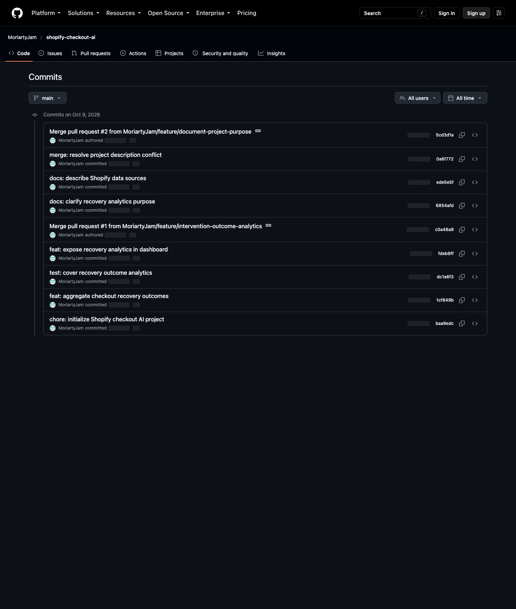
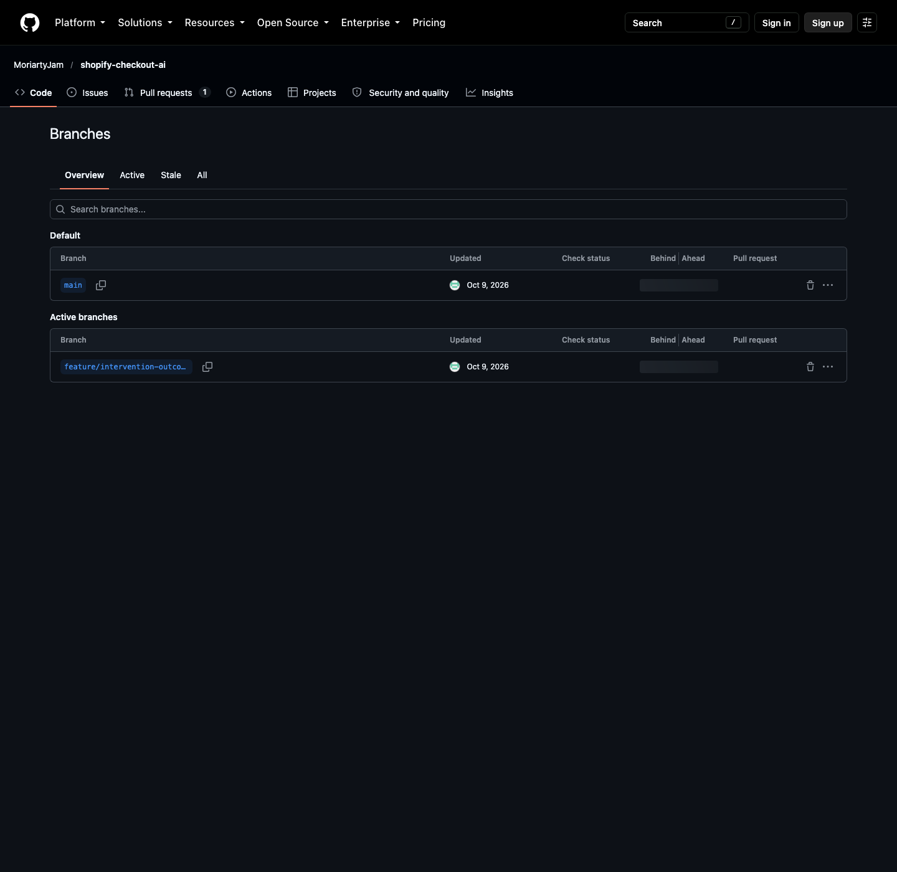
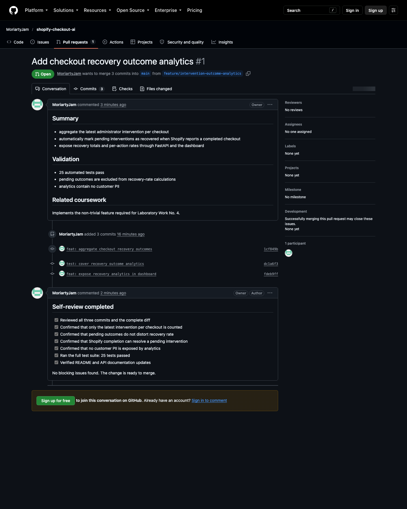
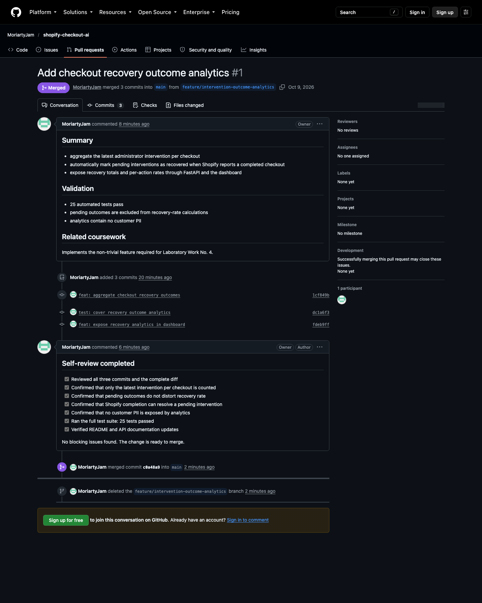
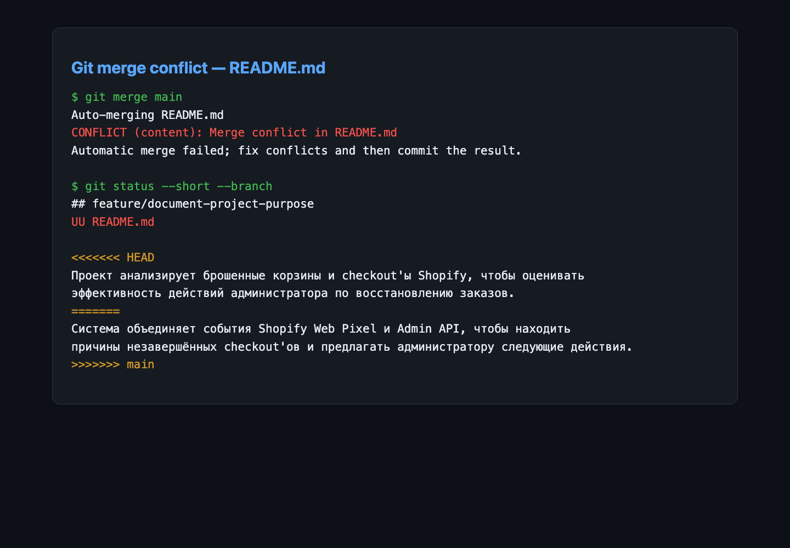
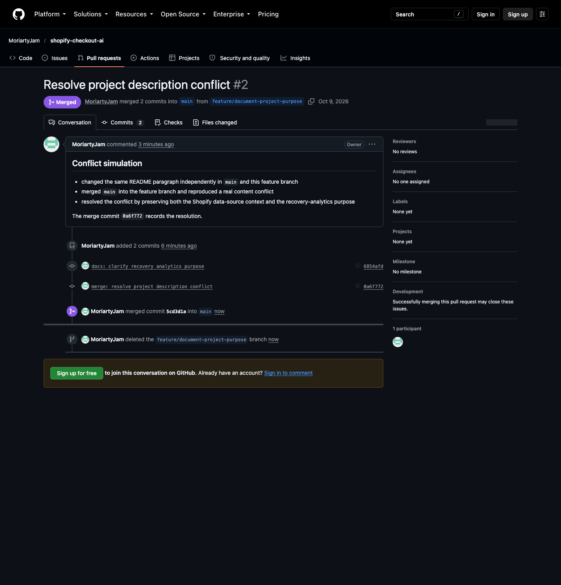

# Звіт до лабораторної роботи №4

## Тема

Організація процесу розробки програмного забезпечення з використанням Git у
наявному проєкті.

## 1. Короткий опис проєкту

**Shopify Checkout AI** — система аналізу покинутих кошиків і checkout у
Shopify. Вона об'єднує події Shopify Web Pixel з даними Admin API, визначає
можливу причину незавершеної покупки та формує рекомендації адміністратору.
Технологічний стек: Python, FastAPI, TensorFlow, Shopify Web Pixels, Shopify
Admin GraphQL API, JavaScript/TypeScript та автоматизовані тести `unittest`.

Репозиторій: <https://github.com/MoriartyJam/shopify-checkout-ai>

## 2. Підключення Git і структура репозиторію

У корені наявного проєкту було ініціалізовано репозиторій з основною гілкою
`main`. Створено `.gitignore`, який виключає віртуальне середовище, кеші,
`node_modules`, локальні файли Shopify CLI, секрети, персональні checkout-дані
та згенеровані моделі. Файл `README.md` містить призначення, структуру та
інструкції запуску проєкту.

Початковий коміт:

```text
baa9edc chore: initialize Shopify checkout AI project
```

## 3. Реалізація нової функціональності

Для розробки створено гілку:

```text
feature/intervention-outcome-analytics
```

Додано нетривіальний модуль аналітики результатів recovery-впливів. Функція:

- об'єднує checkout з діями адміністратора;
- враховує лише останню дію для кожного checkout;
- автоматично визначає відновлену покупку за результатом Shopify;
- розділяє результати на `recovered`, `not_recovered` і `pending`;
- рахує recovery rate загалом і для кожного типу дії;
- не враховує незавершені спостереження у відсотку ефективності;
- не використовує персональні дані покупця.

Серію змін виконано трьома осмисленими комітами:

```text
1cf849b feat: aggregate checkout recovery outcomes
dc1a6f3 test: cover recovery outcome analytics
fdeb9ff feat: expose recovery analytics in dashboard
```

Повний набір із 25 автоматизованих тестів завершився успішно.



## 4. Робота з гілками

Гілки `main` та `feature/intervention-outcome-analytics` було опубліковано на
GitHub. Основною гілкою репозиторію налаштовано `main`.



## 5. Pull Request і self-review

Створено Pull Request №1:
[Add checkout recovery outcome analytics](https://github.com/MoriartyJam/shopify-checkout-ai/pull/1).

В описі PR наведено зміст змін, результати тестування та обмеження щодо
персональних даних. Під час self-review перевірено всі три коміти, повний diff,
алгоритм вибору останнього впливу, розрахунок recovery rate, автоматичне
визначення завершеного Shopify checkout і документацію. Блокуючих проблем не
виявлено.



Після перевірки PR було об'єднано в `main` merge-комітом `c0a48a9`, а віддалену
feature-гілку видалено.



## 6. Моделювання та вирішення конфлікту

Після першого merge створено другу гілку:

```text
feature/document-project-purpose
```

У цій гілці та в `main` незалежно змінено один і той самий абзац `README.md`.
Під час виконання `git merge main` Git виявив змістовий конфлікт:

```text
Auto-merging README.md
CONFLICT (content): Merge conflict in README.md
Automatic merge failed; fix conflicts and then commit the result.
```



Конфлікт вирішено вручну: у фінальному тексті збережено інформацію і про
джерела Shopify Web Pixel/Admin API, і про оцінювання ефективності recovery.
Результат зафіксовано комітом:

```text
0a6f772 merge: resolve project description conflict
```

Для перевірки створено та об'єднано
[Pull Request №2](https://github.com/MoriartyJam/shopify-checkout-ai/pull/2).



## 7. Підсумковий Git-лог

```text
*   5cd3d1a Merge pull request #2 from MoriartyJam/feature/document-project-purpose
|\
| *   0a6f772 merge: resolve project description conflict
| |\
| |/
|/|
* | ede5e5f docs: describe Shopify data sources
| * 6854afd docs: clarify recovery analytics purpose
|/
*   c0a48a9 Merge pull request #1 from MoriartyJam/feature/intervention-outcome-analytics
|\
| * fdeb9ff feat: expose recovery analytics in dashboard
| * dc1a6f3 test: cover recovery outcome analytics
| * 1cf849b feat: aggregate checkout recovery outcomes
|/
* baa9edc chore: initialize Shopify checkout AI project
```

## 8. Висновки

У межах лабораторної роботи Git було інтегровано в наявний програмний проєкт.
Зміни реалізовано в окремій feature-гілці серією осмислених комітів, опубліковано
на GitHub, перевірено через self-review та інтегровано за допомогою Pull Request.
Також змодельовано реальний конфлікт паралельних змін, виконано його ручне
вирішення та повторну інтеграцію в `main`. У результаті сформовано прозору й
відтворювану історію розробки проєкту.
